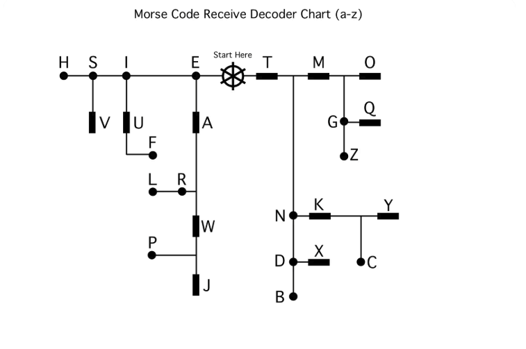
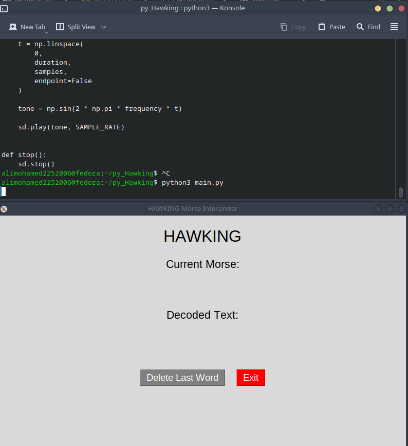

# Project HAWKING
_____
The project is named **HAWKING** in reference to Stephen Hawking, reflecting the project's focus on communication, signals, and the interpretation of information!
_____

Created a bare-metal Morse code interpreter developed on the STM32F446RE.

The project is written in C and interacts directly with the STM32 peripherals through memory-mapped registers rather than using a hardware abstraction layer.

<p align="center">
  
</p>

## Project Goals

The goal of HAWKING is to build a complete embedded system while developing a deeper understanding of:

- ARM Cortex-M microcontrollers
- Memory-mapped peripherals
- GPIO
- Timers
- USART
- I2C __in_development__
- LCD communication __in_development__
- Embedded C
- Modular firmware architecture

## Current Features

- GPIO input/output
- Push-button input
- Button debouncing
- TIM2 polling-based delays
- TIM3 polling-based timing
- USART2 communication
- Morse code input
- Morse code binary-tree decoder
- Modular `.c` / `.h` driver structure

## Hardware

- STM32 Nucleo-F446RE
- 16x2 LCD
- PCF8574T I2C backpack
- Push button
- USB connection to PC

## Software

- C
- STM32F446RE
- ARM Cortex-M4
- STM32CubeIDE
- Register-level peripheral programming



[Watch the HAWKING Morse Code Demonstration](videos/ARM_MORSE_CODE.mp4)

  ## Python PC Interface

HAWKING also includes a Python-based PC application that communicates with the STM32 over USART.

The Python application acts as the host-side interface for the embedded system. It receives serial messages from the STM32 and provides feedback to the user, including decoded Morse characters and audio signals for Morse input events.

The Python side is intentionally kept separate from the firmware. The STM32 is responsible for the embedded hardware, input handling, and timing, while the PC application handles higher-level user interaction.

### Python Components

- Serial communication with the STM32
- Continuous serial data listening
- Morse input feedback
- Audio feedback for dots and dashes
- Handling of control messages from the STM32
- Separation of serial communication, sound generation, and application logic

### Architecture

```text
                 HAWKING
                    |
              STM32F446RE
                    |
                 USART2
                    |
                   USB
                    |
                    v
            Python Application
                    |
          +---------+---------+
          |                   |
    Serial Listener         Sound
          |                   |
    Process messages      Audio feedback
```

### Project Structure

```text

HAWKING/
├── Inc/
│   ├── stm32f446xx.h
│   ├── TIMx.h
│   ├── GPIOAx.h
│   ├── USART.h
│   └── morse_decode.h
│
├── Src/
│   ├── main.c
│   ├── TIMx.c
│   ├── GPIOAx.c
│   ├── USART.c
│   └── morse_decode.c
│
├── Startup/
├── STM32F446RETX_FLASH.ld
└── README.md

```

